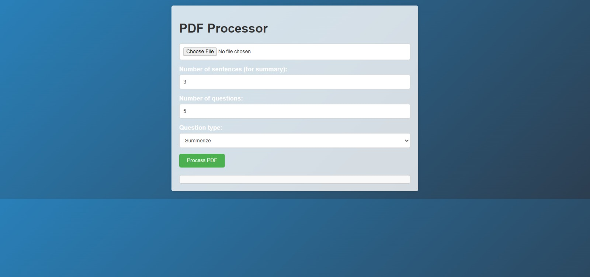
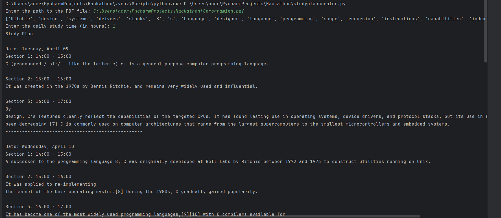
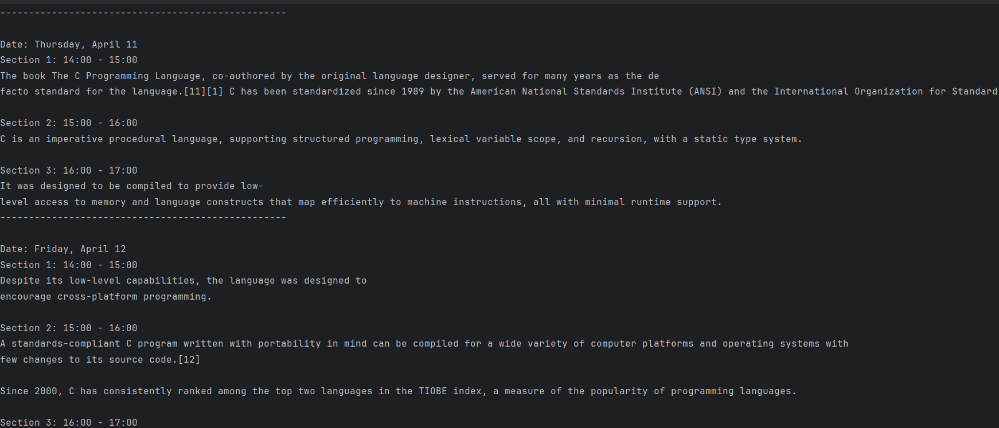
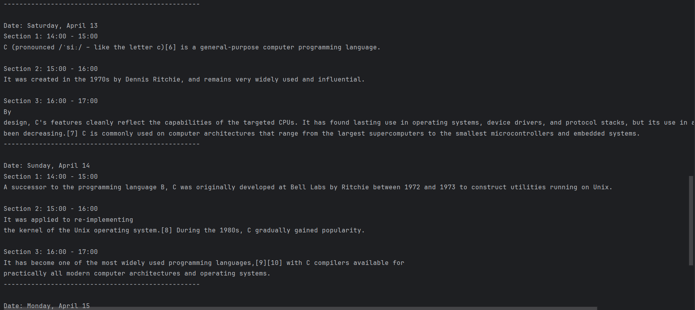
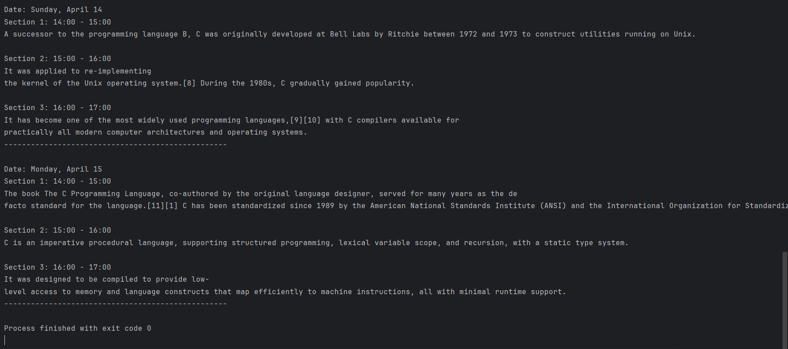
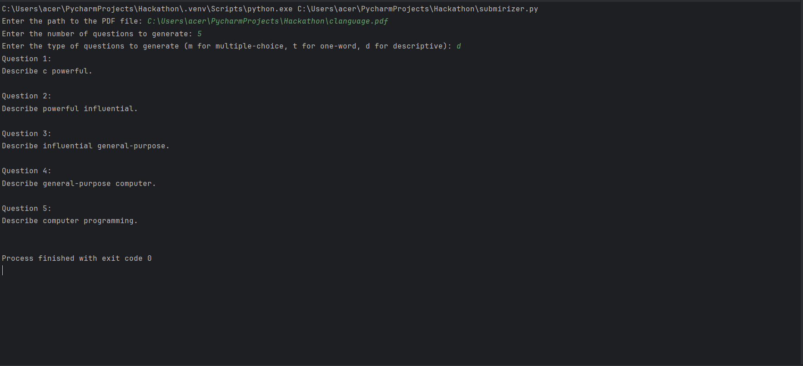
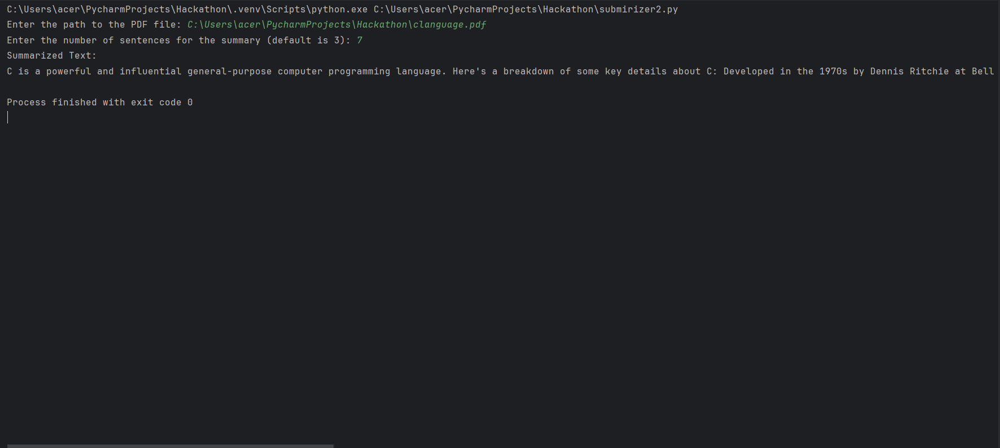

## Usage

### Study Plan Generation

  1. Run the `study_planner.py` script:
     ```
     python study_planner.py
     ```

  2. Enter the path to the PDF file when prompted.

  3. Follow the instructions to specify the daily study time and view the generated study plan.

### Text Summarization

  1. Run the `text_summarizer.py` script:
     ```
     python text_summarizer.py
     ```

  2. Enter the path to the PDF file when prompted.

  3. Optionally, specify the number of sentences for the summary.

  4. View the summarized text output.

## Contributing

Contributions are welcome! If you'd like to contribute to this project, please follow these steps:

  1. Fork the repository.
  2. Create a new branch (`git checkout -b feature/improvement`).
  3. Make your changes.
  4. Commit your changes (`git commit -am 'Add new feature'`).
  5. Push to the branch (`git push origin feature/improvement`).
  6. Create a new Pull Request.

## Install the following python libraries:
  1. `pip install nltk`
  2. `pip install Flask pdfminer.six`
  3. `pip install pdfminer.six`
  4. `pip install sumy`

## Screenshorts

### Site Snippet
	
 
### Outputs
	# Study Planner
 		
   		
		
		

	# Q&A
 		

 	# Summarizer
  		
